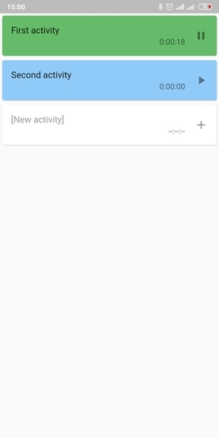
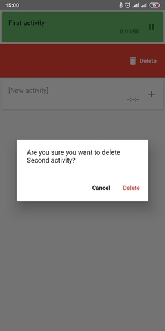

# Timertinio

Simple mobile application to track your activity. 

## How does it work?

Create activity, start to run timer and stop when the activity is over. Start again to continue the timer.

## Screenshots

